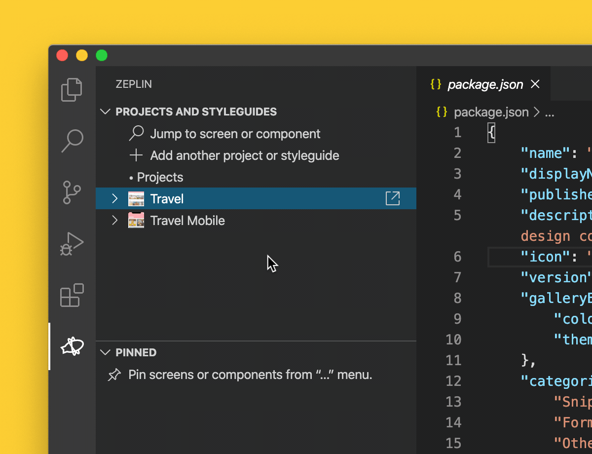

# Zeplin for Visual Studio Code

Zeplin for Visual Studio Code lets you quickly access the designs you’re working on, follow design changes, open the Jira issues they’re attached to —all from within VS Code. 🔌

## Installation

1. [Install](https://marketplace.visualstudio.com/items?itemName=zeplin.zeplin) Zeplin from Visual Studio Code extension marketplace.
2. Open the new Zeplin sidebar.
3. Login to Zeplin.

## Usage

### Access designs you’re working on

The Zeplin sidebar in Visual Studio Code lets you access the designs you’re actively working on.

Get started by adding a project. Once you add one, all the screens and components in the project will be listed in the sidebar. You can quickly open each screen or component in Zeplin by clicking the “Open in Zeplin” icon in each row. Similar to adding projects, you can also add styleguides and access all their components.

You can also pin screens or components you frequently visit, and they will be listed under the “Pinned” panel.

### Follow designs changes

The Zeplin sidebar lets you to see which designs have been updated since you last visited. Once you add a project, Zeplin will list changes to screens and components under the “Activity” panel.

### Open Jira issues

Using [Zeplin for Jira](https://blog.zeplin.io/zeplin-for-jira-is-here-enabling-two-way-collaboration-8f59c03a5faf), you can attach Zeplin resources to Jira issues. This enables two-way collaboration—when you’re viewing a design in Zeplin, you can open the related Jira issue.

The Zeplin sidebar lets you view which resources are attached to a Jira issue by displaying a Jira icon in the row, and clicking the icon opens the Jira issue directly. Coupled with the “Pinned” panel, you can quickly access Jira issues of designs you frequently visit.

### Manage Connected Components configuration

[Connected Components](https://zpl.io/connected-components) in Zeplin lets you access components in your codebase directly on designs in Zeplin, with links to Storybook, GitHub and any other source of documentation based on your workflow. 🧩

Zeplin for Visual Studio Code makes it easier to create the JSON configuration file that connects components in your codebase to their design counterparts in Zeplin. Check out our getting [started guide for Connected Components](https://github.com/zeplin/connected-components-docs/).

## Contributing and Issue Tracking

See [CONTRIBUTING.md](./CONTRIBUTING.md) for details.
